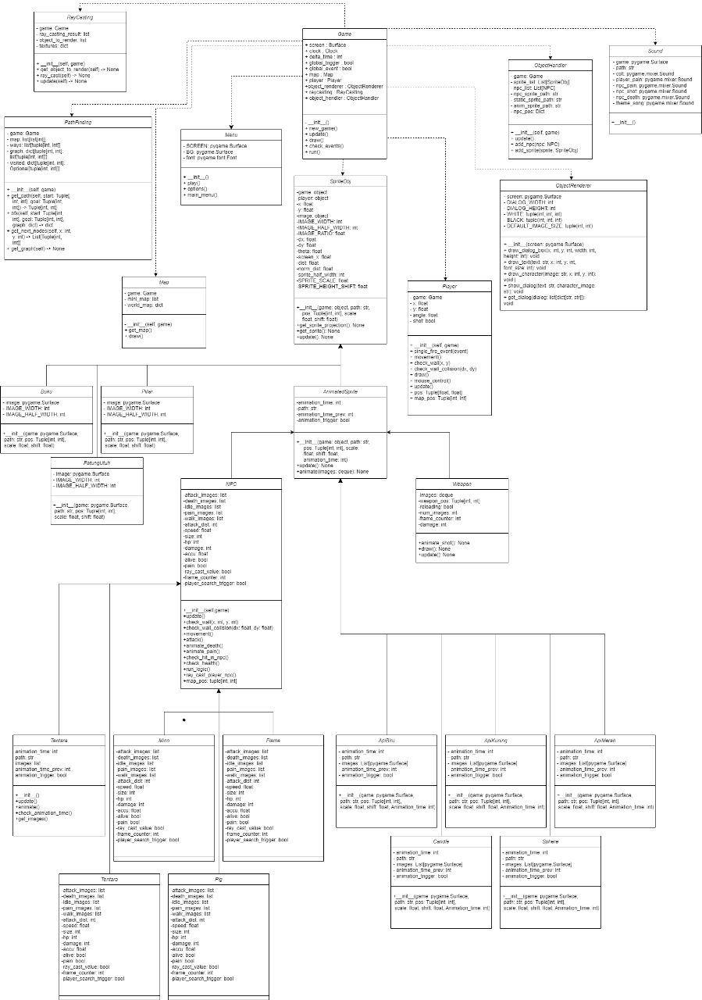

# Judul Game

Apocalypse Dominator

# Deskripsi Game

Apocalypse Dominator adalah sebuah game first-person. Game ini dibuat menggunakan bahasa pemrograman Python dan library Pygame. Dalam game ini, pemain akan memerankan karakter Ghulwan, seorang prajurit uji coba yang berhasil dihidupkan kembali setelah ratusan tahun dibekukan. Ghulwan dan timnya diberi misi untuk mencari tahu penyebab terjadinya munculnya makhluk ganas yang telah menghancurkan hampir 80% kehidupan di bumi. Dalam perjalanan misinya, Tokoh utama harus berhadapan dengan berbagai macam makhluk ganas yang bisa mengubah manusia menjadi satu di antara mereka. Untuk menghadapinya, Tokoh utama akan dilengkapi dengan senjata yang digunakan untuk melalui pertarungan melawan beberapa makhluk yang telah diciptakan. Kami telah menerapkan beberapa konsep PBO pada game ini yaitu inheritance, abstraction, polymorphism, dan encapsulation untuk membuat gameplay yang menarik dan seru.

# Cara Menjalankan Game

1. Download Python (https://www.python.org/downloads/)
2. Install library pygame
   Run the following in the terminal to install the Pygame library

```
pip3 install pygame
```

3. jalankan program python di main.py

# Cara Bermain

Kami menggunakan kontrol mouse dan keyboard sebagai penggerak sebagaimana umumnya game yang ada. Dengan menggunakan W untuk maju, A untuk bergerak ke arah kiri, S untuk bergerak mundur, D untuk bergerak kearah kanan, dan R untuk reload. Kami juga menggunakan mouse untuk interaksi antara karakter yang kami buat dengan user agar karakter bisa melihat 360°. Kami juga menggunakan tombol kanan untuk menembak. Untuk menyelesaikan game ini pemain diharuskan untuk mengalahkan seluruh musuh yang ada serta mengalahkan bos terakhir. Hp pemain juga akan beregenerasi setiap detik untuk mempermudah dalam menyelesaikan permainan.

# Dependensi paket (library) yang dibutuhkan untuk menjalankan aplikasi :

Pygame
System
Textwarp
Time
Math

## UML Class Diagram



# Kontributor

| Nama                       | NIM       | Kontribusi                             |
| -------------------------- | --------- | -------------------------------------- |
| Ghulwan Shihabuddin (lead) | 121140164 | Story + Asset Game                     |
| Ihsan Triyadi              | 121140163 | Map + Asset Game                       |
| Andreas Sihotang           | 121140168 | Main Programmer                        |
| Ahmad Fadillah             | 121140173 | Project Manager + Secondary Programmer |
| M Daffa Fahreza            | 121140178 | Enemmy + Asset Game + PPT              |
| Daffa Abdurohman Jatmiko   | 121140181 | Secondary Programmer + UML             |
